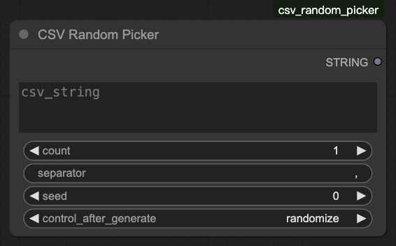

# ComfyUI-CSV-Random-Picker
String random picker for ComfyUI

## Preview

## Usage
- csv_string: The string to be shuffled.
- count: The number of items to be output.
- separator: The delimiter to use when outputting.
- seed: Random Seed.
